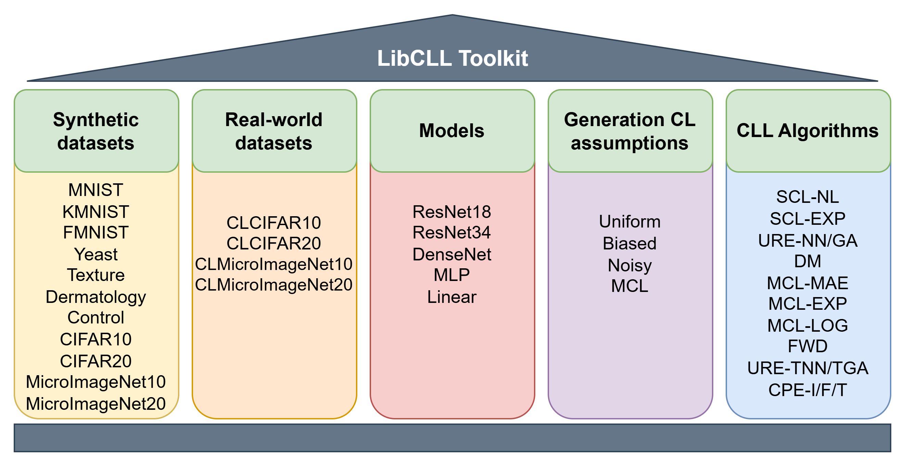

# libcll: Complementary Label Learning Benchmark

[](https://libcll.readthedocs.io/en/latest/?badge=latest) [](https://github.com/psf/black)



`libcll` is a Python library designed to simplify complementary-label learning (CLL) for researchers tackling real-world challenges. The package implements a wide range of popular CLL strategies, including **CPE**, the state-of-the-art algorithm as of 2023. Additionally, it includes unique datasets like **CLCIFAR10**, **CLCIFAR20**, **CLMIN10**, and **CLMIN20**, which feature complementary labels collected from human annotators. To foster extensibility, `libcll` provides a unified interface for integrating additional strategies, datasets, and models, making it a versatile tool for advancing CLL research. For more details, refer to the associated technical report on [arXiv](https://arxiv.org/abs/2411.12276).

# Installation

- Python version >= 3.8, <= 3.12
- Pytorch version >= 1.11, <= 2.0
- Pytorch Lightning version >= 2.0
- To install `libcll` and develop locally:

```
git clone git@github.com:ntucllab/libcll.git
cd libcll
pip install -e .
```

# Running

## Supported Strategies

| Strategies                                                 | Type             | Description                                                  |
| ---------------------------------------------------------- | ---------------- | ------------------------------------------------------------ |
| [PC](https://arxiv.org/pdf/1705.07541)                     | None             | Pairwise-Comparison Loss                                     |
| [SCL](https://arxiv.org/pdf/2007.02235.pdf)                | NL, EXP          | Surrogate Complementary Loss with the negative log loss (NL) or with the exponential loss (EXP) |
| [URE](https://arxiv.org/pdf/1810.04327.pdf)                | NN, GA, TNN, TGA | Unbiased Risk Estimator whether with gradient ascent (GA) or empirical transition matrix (T) |
| [FWD](https://arxiv.org/pdf/1711.09535.pdf)                | None             | Forward Correction                                           |
| [DM](http://proceedings.mlr.press/v139/gao21d/gao21d.pdf)  | None             | Discriminative Models with Weighted Loss                     |
| [CPE](https://arxiv.org/pdf/2209.09500.pdf)                | I, F, T          | Complementary Probability Estimates with different transition matrices (I, F, T) |
| [MCL](https://arxiv.org/pdf/1912.12927.pdf)                | MAE, EXP, LOG    | Multiple Complementary Label learning with different errors (MAE, EXP, LOG) |
| [OP](https://proceedings.mlr.press/v206/liu23g/liu23g.pdf) | None             | Order-Preserving Loss                                        |
| [SCARCE](https://arxiv.org/pdf/2311.15502)                 | None             | Selected-Completely-At-Random Complementary-label learning   |

## Supported Datasets

| Dataset     | Number of Classes | Input Size  | Description                                                  |
| ----------- | --------------- | ----------- | ------------------------------------------------------------ |
| MNIST       | 10              | 28 x 28     | Grayscale images of handwritten digits (0 to 9).             |
| FMNIST      | 10              | 28 x 28     | Grayscale images of fashion items.                           |
| KMNIST      | 10              | 28 x 28     | Grayscale images of cursive Japanese (“Kuzushiji”) characters. |
| [Yeast](https://www.openml.org/search?type=data&status=active&id=181) | 10              | 8           | Features of different localization sites of protein.         |
| [Texture](https://www.openml.org/search?type=data&status=active&id=40499) | 11              | 40          | Features of different textures.                              |
| [Dermatology](https://www.openml.org/search?type=data&status=active&id=35) | 6               | 130         | Clinical Attributes of different diseases.                              |
| [Control](https://www.openml.org/search?type=data&status=active&id=377) | 6               | 60          | Features of synthetically generated control charts.          |
| CIFAR10 | 10 | 3 x 32 x 32 | Colored images of different objects. |
| CIFAR20     | 20              | 3 x 32 x 32 | Colored images of different objects. |
| Micro ImageNet10   | 10                | 3 x 64 x 64 | Contains images of 10 classes designed for computer vision research. |
| Micro ImageNet20 | 20 | 3 x 64 x 64 | Contains images of 20 classes designed for computer vision research. |
| CLCIFAR10   | 10              | 3 x 32 x 32 | Colored images of distinct objects paired with complementary labels annotated by humans. |
| CLCIFAR20   | 20              | 3 x 32 x 32 | Colored images of distinct objects paired with complementary labels annotated by humans. |
| CLMicro ImageNet10 | 10 | 3 x 64 x 64 | Contains images of 10 classes designed for computer vision research paired with complementary labels annotated by humans. |
| CLMicro ImageNet20 | 20 | 3 x 64 x 64 | Contains images of 20 classes designed for computer vision research paired with complementary labels annotated by humans. |
| ACLCIFAR10   | 10              | 3 x 32 x 32 | Colored images of distinct objects paired with complementary labels annotated by Visual-Language Models. |
| ACLCIFAR20   | 20              | 3 x 32 x 32 | Colored images of distinct objects paired with complementary labels annotated by Visual-Language Models. |
| ACLMicro ImageNet10 | 10 | 3 x 64 x 64 | Contains images of 10 classes designed for computer vision research paired with complementary labels annotated by Visual-Language Models. |
| ACLMicro ImageNet20 | 20 | 3 x 64 x 64 | Contains images of 20 classes designed for computer vision research paired with complementary labels annotated by Visual-Language Models. |

## Quick Start: Complementary Label Learning on MNIST

To reproduce training results with the SCL-NL method on MNIST

```shell
python script/train.py \
  --do_train \
  --do_predict \
  --strategy SCL \
  --type NL \
  --model MLP \
  --dataset MNIST \
  --lr 1e-4 \
  --batch_size 256 \
  --valid_type Accuracy \
```

## Run all the settings in the survey paper

To reproduce results in survey paper:

```shell
./scripts/uniform.sh <strategy> <type>
./scripts/biased.sh <strategy> <type>
./scripts/noisy.sh <strategy> <type>
./scripts/multi.sh <strategy> <type>
./scripts/multi_hard.sh <strategy> <type>
```

For example:

```shell
./scripts/uniform.sh SCL NL
./scripts/biased.sh SCL NL
./scripts/noisy.sh SCL NL
./scripts/multi.sh SCL NL
./scripts/multi_hard.sh SCL NL
```

# Documentation

The documentation for the latest release is available on [readthedocs](https://libcll.readthedocs.io/en/latest/). Feedback, questions, and suggestions are highly encouraged. Contributions to improve the documentation are warmly welcomed and greatly appreciated!

# Citing

If you find this package useful, please cite both the original works associated with each strategy and the following:

```
@techreport{libcll2024,
  author = {Nai-Xuan Ye and Tan-Ha Mai and Hsiu-Hsuan Wang and Wei-I Lin and Hsuan-Tien Lin},
  title = {libcll: an Extendable Python Toolkit for Complementary-Label Learning},
  institution = {National Taiwan University},
  url = {https://github.com/ntucllab/libcll},
  note = {available as arXiv preprint \url{https://arxiv.org/abs/2411.12276}},
  month = nov,
  year = 2024
}
```

# Acknowledgment

We would like to express our gratitude to the following repositories for sharing their code, which greatly facilitated the development of `libcll`:
* [URE and FWD implementation](https://github.com/takashiishida/comp)
* [DM official implementation](http://palm.seu.edu.cn/zhangml/Resources.htm#icml21b)
* [OP official implementation](https://github.com/yzcao-nkg/OPCLL)
* [SCARCE official implementation](https://github.com/wwangwitsel/SCARCE/tree/main)
* [Code structure](https://github.com/ntucllab/imbalanced-DL)
